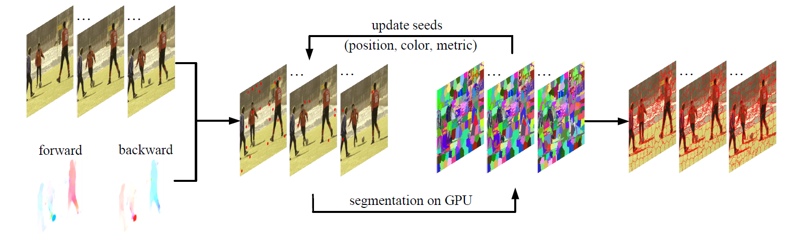

# GPU-based Supervoxel Generation with a Novel Anisotropic Metric


We provide the source code that tested on Windows for the paper: 
> **GPU-based Supervoxel Generation with a Novel Anisotropic Metric**
>
> Xiao Dong, 
> Zhonggui Chen, 
> Yong-Jin Liu, 
> Junfeng Yao, 
> Xiaohu Guo
>
> IEEE transactions on image processing, 2021


## Runtime Environment 
```
The project requires: OpenGL 4.2 or later; Eigen library; OpenCV with GPU support.

The GLFW3 is provided in the project, you need to download Eigen to the "includes" dir, and install OpenCV with Cuda support, configure the project by CMakeLists and specify the "OpenCV_DIR" in CMakeLists.txt.
```
## Parameters 
```
Specify the paths of input dataset and the output file in main.cpp.

The program generates supervoxel segmentation results, including txt files and pseudo-color images.

Download the video datasets (SegTrackv2, BuffaloXiph) provided in LIBSVXv4.0: http://www.cs.rochester.edu/~cxu22/d/libsvx/
```
## License
```
The codes in this repository are under the GNU AFFERO GENERAL PUBLIC LICENSE as specified by the LICENSE file.
```
## Citation
```
@article{donggpu,
  title={GPU-based Supervoxel Generation with a Novel Anisotropic Metric},
  author={Dong, Xiao and Chen, Zhonggui and Liu, Yong-Jin and Yao, Junfeng and Guo, Xiaohu},
  journal={IEEE transactions on image processing: a publication of the IEEE Signal Processing Society},
  year = {2021}
}
```

